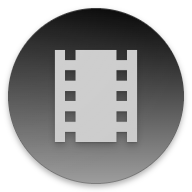

# MovieDatabase

  

Movie Database is an Android app built using Jetpack Compose and the MVVM architecture. It fetches movie data via a remote API (using Retrofit and Kotlin Serialization) and caches it locally with Room. The app features Material Design 3 styling, supports dark mode, and includes a smooth splash screen experience on Android 12 and above.
